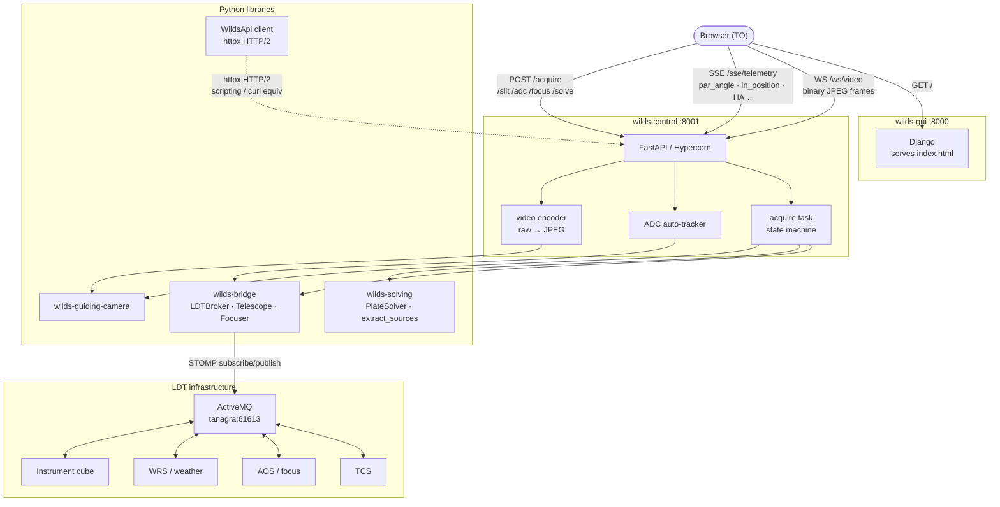

# WILDS System Architecture

```mermaid
graph TB
    TO(["Browser (TO)"])

    subgraph gui["wilds-gui  :8000"]
        Django["Django\nserves index.html"]
    end

    subgraph ctrl["wilds-control  :8001"]
        FastAPI["FastAPI / Hypercorn"]
        Acquire["acquire task\nstate machine"]
        ADCTrack["ADC auto-tracker"]
        VideoEnc["video encoder\nraw → JPEG"]
    end

    subgraph libs["Python libraries"]
        Bridge["wilds-bridge\nLDTBroker · Telescope · Focuser"]
        Solving["wilds-solving\nPlateSolver · extract_sources"]
        Camera["wilds-guiding-camera"]
        WildsApi["WildsApi client\nhttpx HTTP/2"]
    end

    subgraph ldt["LDT infrastructure"]
        AMQ["ActiveMQ\ntanagra:61613"]
        TCS["TCS"]
        AOS["AOS / focus"]
        WRS["WRS / weather"]
        ICube["Instrument cube"]
    end

    TO -- "GET /" --> Django
    TO -- "WS /ws/video\nbinary JPEG frames" --> FastAPI
    TO -- "SSE /sse/telemetry\npar_angle · in_position · HA…" --> FastAPI
    TO -- "POST /acquire\n/slit /adc /focus /solve" --> FastAPI

    FastAPI --> Acquire
    FastAPI --> ADCTrack
    FastAPI --> VideoEnc

    Acquire --> Bridge
    Acquire --> Solving
    Acquire --> Camera
    ADCTrack --> Bridge
    VideoEnc --> Camera

    Bridge -- "STOMP subscribe/publish" --> AMQ
    AMQ <--> TCS
    AMQ <--> AOS
    AMQ <--> WRS
    AMQ <--> ICube

    WildsApi -. "httpx HTTP/2\nscripting / curl equiv" .-> FastAPI
```
